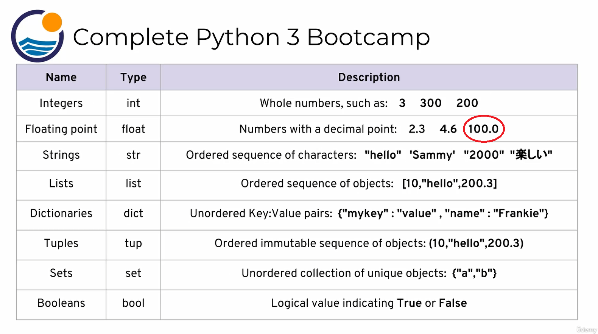
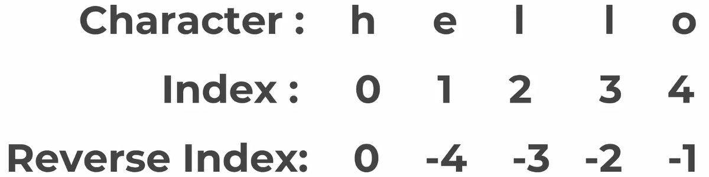
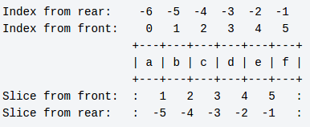

## Contracts

1. `??` means, I have a question.

# Unwatched

2. Course Introduction
3. Course Curriculum Overview
4. Why Python
5. Installing Python (Step by Step)
6. Installing Python on Windows and updated Jupyter Notebook Introduction

# 02. Python Setup

## 6. Running Python Code

you can run Python scripts at your command line.

```bash
python e1.py
```

Python interpreter:

```bash
PS E:\projects\python> python
Python 3.14.5 (tags/v3.14.5:5607950, May 10 2026, 10:43:50) [MSC v.1944 64 bit (AMD64)] on win32
Type "help", "copyright", "credits" or "license" for more information.
Ctrl click to launch VS Code Native REPL
>>> print("!")
!
>>> quit()
PS E:\projects\python>
```

# 03. Python Object and Data Structure Basics

## 1. Introduction to Python Data Types



# 9. Indexing and Slicing with Strings

```python
firstName = "Mohammad"
print(firstName[3])  # a
```



slicing:

```python
[start(optional):stop(optional):step(optional)]
```



```python
print("Mohammad"[::-1])  # dammahoM

```

## 12. String Properties and Methods

```python
print("M" + "H")  # MH
print(10 * "q")  # qqqqqqqqqq
```

sounds like that the string in python is an object! ??

```python
x = 'something'
print(x.upper()) # SOMETHING
print(x.upper) # <built-in method upper of str object at 0x0000018CD78D4470>
```

```python
x = "something"
print(f"I wanna say {x}") # I wanna say something

```
