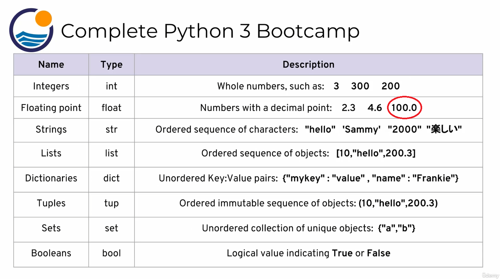
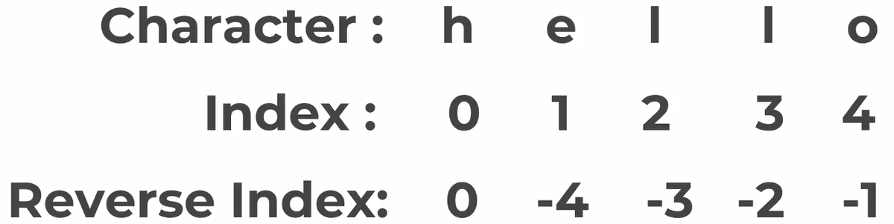
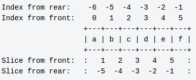
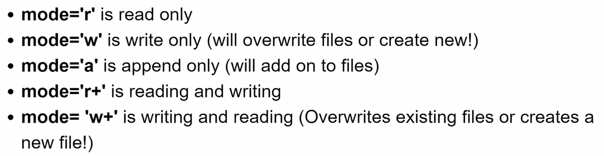

# Contracts

1. `??` means, I have a question.

# Unwatched

2. Course Introduction
3. Course Curriculum Overview
4. Why Python
5. Installing Python (Step by Step)
6. Installing Python on Windows and updated Jupyter Notebook Introduction

# 02. Python Setup

## 6. Running Python Code

you can run Python scripts at your command line.

```bash
python e1.py
```

Python interpreter:

```bash
PS E:\projects\python> python
Python 3.14.5 (tags/v3.14.5:5607950, May 10 2026, 10:43:50) [MSC v.1944 64 bit (AMD64)] on win32
Type "help", "copyright", "credits" or "license" for more information.
Ctrl click to launch VS Code Native REPL
>>> print("!")
!
>>> quit()
PS E:\projects\python>
```

# 03. Python Object and Data Structure Basics

## 1. Introduction to Python Data Types



## 9. Indexing and Slicing with Strings

```python
firstName = "Mohammad"
print(firstName[3])  # a
```



slicing:

```python
[start(optional):stop(optional):step(optional)]
```



```python
print("Mohammad"[::-1])  # dammahoM

```

## 12. String Properties and Methods

```python
print("M" + "H")  # MH
print(10 * "q")  # qqqqqqqqqq
```

string in python is class/object!

```python
x = 'something'
print(x.upper()) # SOMETHING
print(x.upper) # <built-in method upper of str object at 0x0000018CD78D4470>
```

```python
x = "something"
print(f"I wanna say {x}") # I wanna say something

```

## 18. Lists in Python

indexing and slicing and concatenate in lists works just like a string in python

list is also class/object!

```python
list = [5, 1, 8, 3]
sorted_list = list.sort()
print(list)  # [1, 3, 5, 8]
print(sorted_list) # None
print(type(sorted_list)) # <class 'NoneType'>
```

`NoneType` is a data type in Python and has only one value: None.

## 22. Dictionaries in Python

```python
my_dic = {"key1": 1, "key2": "value2"}
print(my_dic["key1"]) # 1
my_dic["key3"] = "chem!"
```

## 28. Sets in Python

```python
s = {1, "a"}
s.add("chem")
```

```python
myList = [8, 10, 8, 8, 10, 1, 80, 80, 80, 10] # can be a string too!
print(set(myList))  # {8, 1, 10, 80}
```

## 32. IO with Basic Files in Python

the methods we show here will also expand further to working with other file types.

```python
myFile = open("test.txt")
readMyFile = myFile.read()
print(readMyFile)
print(myFile.read()) # ''
```

the reason this is happening is because you can imagine that there's a cursor at the beginning of the file and when you read it the cursor goes all the way to the end of the file and you need to reset the cursor or seek it back to zero in order to read it again

```python
myFile.seek(0)
```

```python
myFile = open("E:\\projects\\python\\test.txt")
print(myFile.readlines())
# [
# 'Hello\n',
# 'this is a test text file\n',
# 'this is the second line\n',
# 'this is the third line '
# ]
myFile.close()
```

```python
with open("test.txt", "a") as myFile:
    readMyFile = myFile.write("this is the forth line")
print(readMyFile)
```



# 05. Python Statements

## For Loops in Python

```python
for _ in "Hello world!":
    print("cool!")
```

```python
list = [(1, 2), (3, 4)]
for a, b in list: # or (a, b)
    print(a)
    print(b)
```

```python
dic = {"k1": 1, "k2": 2, "k3": 3}
for item in dic:
    print(item)  # k1
print(dic.items())
# dict_items([('k1', 1), ('k2', 2), ('k3', 3)])
print(type(dic.items()))
# <class 'dict_items'>
for item in dic.items():  # or key, value
    print(item)  # ('k1', 1)
    print(type(item))  # <class 'tuple'>
print(type(dic.values()))
# <class 'dict_values'>
for value in dic.values():
    print(value)  # 1
```

```python
print(range(5))  # range(0, 5)
print(type(range(5)))  # <class 'range'>
print(list(range(5)))  # [0, 1, 2, 3, 4]
# here we cast
for i in range(2, 5, 1):
    print(i)  # 2 3 4
```

```python
text = "I love python!"
for item in enumerate(text):
    print(item)  # (0, 'I')
    print(type(item))  # <class 'tuple'>
print(enumerate(text))  # !
print(type(enumerate(text)))  # <class 'enumerate'>
# I think, i think, in python we don't have (index, value) in common for loop,
# we have to use enumerate to have (index, value)
```
