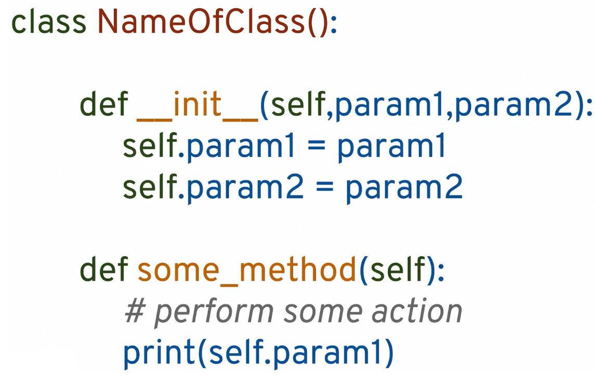

# Contracts

1. `??` means, I have a question.

# Unwatched

1. Polymorphism

# 02. Python Setup

## 6. Running Python Code

you can run Python scripts at your command line.

```bash
python e1.py
```

Python interpreter:

```bash
PS E:\projects\python> python
Python 3.14.5 (tags/v3.14.5:5607950, May 10 2026, 10:43:50) [MSC v.1944 64 bit (AMD64)] on win32
Type "help", "copyright", "credits" or "license" for more information.
Ctrl click to launch VS Code Native REPL
>>> print("!")
!
>>> quit()
PS E:\projects\python>
```

# 03. Python Object and Data Structure Basics

## 1. Introduction to Python Data Types


- the name of variables should be snake_case

- everything in Python is an object

## 9. Indexing and Slicing with Strings

```python
firstName = "Mohammad"
print(firstName[3])  # a
```


slicing:

```python
[start(optional):stop(optional):step(optional)]
```


```python
print("Mohammad"[::-1])  # dammahoM
```

## 12. String Properties and Methods

```python
print("M" + "H")  # MH
print(10 * "q")  # qqqqqqqqqq
```

string in python is class/object!

```python
x = "something"
print(x.upper())  # SOMETHING
print(x.upper)  # <built-in method upper of str object at 0x0000018CD78D4470>
```

```python
x = "something"
print(f"I wanna say {x}")  # I wanna say something
```

## 18. Lists in Python

indexing and slicing and concatenate in lists works just like a string in python

list is also class/object!

```python
list = [5, 1, 8, 3]
sorted_list = list.sort()
print(list)  # [1, 3, 5, 8]
print(sorted_list)  # None
print(type(sorted_list))  # <class 'NoneType'>
```

`NoneType` is a data type in Python and has only one value: None.

## 22. Dictionaries in Python

```python
my_dic = {"key1": 1, "key2": "value2"}
print(my_dic["key1"])  # 1
my_dic["key3"] = "chem!"
```

## 28. Sets in Python

```python
s = {1, "a"}
s.add("chem")
```

```python
myList = [8, 10, 8, 8, 10, 1, 80, 80, 80, 10]  # can be a string too!
print(set(myList))  # {8, 1, 10, 80}
```

## 32. IO with Basic Files in Python

the methods we show here will also expand further to working with other file types.

```python
myFile = open("test.txt")
readMyFile = myFile.read()
print(readMyFile)
print(myFile.read())  # ''
```

the reason this is happening is because you can imagine that there's a cursor at the beginning of the file and when you read it the cursor goes all the way to the end of the file and you need to reset the cursor or seek it back to zero in order to read it again

```python
myFile.seek(0)
```

```python
myFile = open("E:\\projects\\python\\test.txt")
print(myFile.readlines())
# [
# 'Hello\n',
# 'this is a test text file\n',
# 'this is the second line\n',
# 'this is the third line '
# ]
myFile.close()
```

```python
with open("test.txt", "a") as myFile:
    readMyFile = myFile.write("this is the forth line")
print(readMyFile)
```


# 05. Python Statements

## For Loops in Python & ...

```python
for _ in "Hello world!":
    print("cool!")
```

```python
list = [(1, 2), (3, 4)]
for a, b in list:  # or (a, b)
    print(a)
    print(b)
```

```python
dic = {"k1": 1, "k2": 2, "k3": 3}
for item in dic:
    print(item)  # k1
print(dic.items())
# dict_items([('k1', 1), ('k2', 2), ('k3', 3)])
print(type(dic.items()))
# <class 'dict_items'>
for item in dic.items():  # or key, value
    print(item)  # ('k1', 1)
    print(type(item))  # <class 'tuple'>
print(type(dic.values()))
# <class 'dict_values'>
for value in dic.values():
    print(value)  # 1
```

```python
print(range(5))  # range(0, 5)
print(type(range(5)))  # <class 'range'>
print(list(range(5)))  # [0, 1, 2, 3, 4]
# here we cast
for i in range(2, 5, 1):
    print(i)  # 2 3 4
```

```python
text = "I love python!"
for item in enumerate(text):
    print(item)  # (0, 'I')
    print(type(item))  # <class 'tuple'>
print(enumerate(text))  # !
print(type(enumerate(text)))  # <class 'enumerate'>
# I think, i think, in python we don't have (index, value) in common for loop,
# we have to use enumerate to have (index, value)
```

## 4.Useful Operators in Python

```python
print(1 in [10, 1])  # True
print("a" in "bcd")  # False
dic = {"k1": 1, "k2": 2}
print("k1" in dic)  # or "in dic.keys()"  # True
print(1 in dic.values())  # True
```

```python
from random import shuffle

list = [1, 2, 3, 4, 5, 6, 7, 8, 9, 10]
shuffle(list)
print(list)  # [2, 8, 7, 6, 1, 3, 5, 4, 9, 10]

number = input("Enter a number: ")
print(float(number))
```

## 5. List Comprehensions in Python

So if you're ever in a situation where you find yourself using a for loop along with an append statement to create a list, list comprehensions are a good alternative

```python
s = "Hello"
list = [letter for letter in s]
print(list)

list2 = [num**2 for num in range(10)]
print(list2)

list3 = [num for num in range(10) if num % 2 == 0]
print(list3)

list4 = [num if num % 2 == 0 else "odd" for num in range(10)]
print(list4)

# ['H', 'e', 'l', 'l', 'o']
# [0, 1, 4, 9, 16, 25, 36, 49, 64, 81]
# [0, 2, 4, 6, 8]
# [0, 'odd', 2, 'odd', 4, 'odd', 6, 'odd', 8, 'odd']
```

# 06. Methods and Functions

```python
def my_func(param="default"):  # snake_casing
    """
    DocString explains function.
    """
    print(param)


my_func("someThing")
```

## 7. Tuple Unpacking with Python Functions

```python
def my_func():
    return (1, 2)


a, b = my_func()
print(a)
print(b)
```

```python
def player_guess():
    guess = ""

    while guess not in ["1", "2", "3"]:
        guess = input("guess a number between (1, 2, 3): ")

    return guess


player_guess()
```

## 18. args and kwargs in Python

```python
def my_func(*aaargs):
    print(type(aaargs))  # <class 'tuple'>
    print(aaargs)  # (1, 'a', -10.2)


my_func(1, "a", -10.2)
```

```python
def my_func(**kwargs):
    print(type(kwargs))  # <class 'dict'>
    print(kwargs)  # {'a': 1, 'b': 2}


my_func(a=1, b=2)
```

## 27. Lambda Expressions, Map, and Filter Functions

```python
def square(num):
    return num**2


nums = [3, 1, 5]

m = map(square, nums)

print(m)
print(type(m))
print(list(m))

for item in m:
    print(item)
# The output of `map` is an **iterator**, and it can only be iterated over once.

# The filter function works the same way.

square = lambda num: num**2
```

## 28. Nested Statements and Scope

When you create a variable name in Python, that name is stored in what's called the namespace. And variable names also have a scope, and the scope determines the visibility of that variable name to other parts of your code

```python
x = 1


def my_func():
    print(x)


def my_func2():
    y = 3


my_func()
# print(y) # error
```

# 08. Object Oriented Programming

## 1. Object Oriented Programming - Introduction



the name of class should be camelCase

If we want a function inside a class to be an instance method, we have to pass `self` as its first parameter.

```python
class MyClass:
    a = 1

    def __init__(self):
        # chem!
        print(MyClass.a)
        pass


my_class1 = MyClass()
print(my_class1.a)
print(MyClass.a)
```

```python
class Animal:
    can_talk = False

    def __init__(self, is_alive):
        print("animal is created!")
        self.is_alive = is_alive

    def die(self, by):
        self.is_alive = False
        print(f"it die by {by}")


class Dog(Animal):
    def __init__(self):
        print("dog is created")


dog1 = Dog()
print(dog1.is_alive)  # AttributeError: 'Dog' object has no attribute 'is_alive'
print("dog1.can_talk: " + str(dog1.can_talk))
dog1.die("accident")
print("dog1.is_alive next to call .die method: " + str(dog1.is_alive))
```

```python
class Animal:
    def __init__(self, is_alive):
        self.is_alive = is_alive


class Dog(Animal):
    def __init__(self, is_alive):
        Animal.__init__(self, is_alive)
        pass


dog1 = Dog(True)
print(dog1.is_alive)
```

```python
class C:
    def __init__(self):
        pass

    def __str__(self):
        return "someThing!"

    def __len__(self):
        return 0

    def __del__(self):
        print("deleted!")


c1 = C()
print(str(c1))  # someThing!
print(c1)  # someThing!
print(len(c1))  # 0
del c1  # deleted!
```

# 09. Modules and Packages

## 2. Pip Install and PyPi

PyPi is a repository for open-source third party Python packages like NPM for Node.js.

```python
# pip install colorama
from colorama import init
from colorama import Fore

init()
print(Fore.RED + "someThing red!")
print(Fore.GREEN + "someThing green!")
print(Fore.YELLOW + "someThing yellow!")
print(Fore.BLUE + "someThing blue!")
print(Fore.MAGENTA + "someThing magenta!")
print(Fore.CYAN + "someThing cyan!")
```

## 3. Modules and Packages

how to write your own modules and packages

- `modules`, it's really just a .py script but `packages` are then a collection of modules. However, there's a key .py script called `__init__.py` that needs to be placed inside of a folder. you don't actually need to write anything in this file. It just needs to be there so that when Python goes searching through these packages it understands that it's not just a normal directory, it's an actual package. that way you can have different folders for different packages.

<section style="
padding: 10px; 
border: 1px solid #0000003f;
border-radius: 5px;
margin-bottom: 20px
">

`myModule.py`:

```python
print("!")


def my_func():
    print("this is my_func!")
```

`myProgram.py`

```python
from myModule import my_func

my_func()
```

in here the `!` is printed!

</section>

<section style="
padding: 10px; 
border: 1px solid #0000003f;
border-radius: 5px;
margin-bottom: 20px
">


`some_main_script.py`:

```python
def sub_main():
    print("I am some_main_script!")
```

`mySubScript.py`:

```python
def sub_report():
    print("I am mySubScript!")
```

`myProgram.py`

```python
from MyMainPackage import some_main_script
from MyMainPackage.SubPackage import mySubScript

some_main_script.sub_main()
mySubScript.sub_report()
```

</section>

## 4. `__name__` and `__main__`

in Python there is actually a built-in variable called `__name__`. this variable gets assigned a string depending on how you're running the actual script. And if you run the script directly So if I went to the command line, what Python is going to do it's going to assign this built-in variable called `__name__` to be equal to `"__main__"`.

```python
# You have all your functions and classes defined up here


class SomeClass1:
    pass


class SomeClass2:
    pass


class SomeClass3:
    pass


def some_func_1():
    pass


def some_func_2():
    pass


if __name__ == "__main__":
    # run the script just like as C++ that have main()
    # your logic where you actually execute things are defined here at the bottom
    some_func_1()
    some_func_2()
```

# 10. Errors and Exceptions Handling

## 1. Errors and Exception Handling

```python
try:
    pass
except TypeError:
    pass
except:
    # except for any errors
    pass
# if you go to the documentation you can come to "errors and exceptions",
# you'll notice there's a link here to "built-in exceptions"
finally:
    pass
```

## 6. Running tests with the Unittest Library

So unit test allows you to write your own test program. the goal is to send a specific set of data to your program, analyze the returned results and then see if it actually gives you the expected result.

`cap.py`:

```python
def cap_text(text):
    return text.capitalize()
```

`test_cap_or_anyThing.py`:

```python
import unittest
import cap


class TestCapOrChem(unittest.TestCase):
    def test_one_word(self):
        text = "alaki"
        result = cap.cap_text(text)
        self.assertEqual(result, "Alaki")

    def test_multiple_words(self):
        text = "alaki malaki"
        result = cap.cap_text(text)
        self.assertEqual(result, "Alaki Malaki")


if __name__ == "__main__":
    unittest.main()
```
